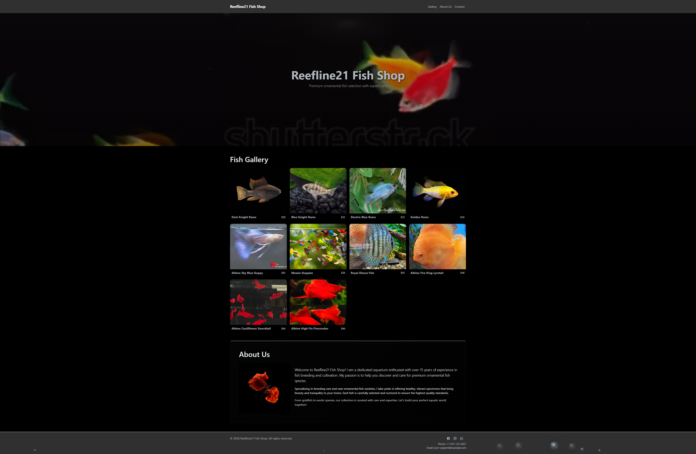

# Reefline21 Fish Shop

An elegant, static ornamental fish showcase website built with **Bootstrap 5** and **jQuery**. Perfect for aquarium enthusiasts and fish breeders to showcase premium specimen collections.



## ✨ Features

### 🎨 Design & Aesthetics
- **High-End Aquarium Display**: Pure black background with professional spotlight effects
- **Glass Morphism UI**: Refined transparency and blur effects throughout
- **Skeuomorphic Bubble Animation**: Realistic floating glass bubbles rising from footer
- **Hero Video Banner**: Full-width WebM video with dynamic overlay
- **Dark Theme**: Bootswatch Darkly theme optimized for professional presentation

### 🐠 Product Showcase
- **Dynamic Fish Catalog**: JSON-driven database with 10 premium fish species
- **Interactive Gallery**: Click fish cards to view detailed species information
- **Image Carousel**: Multi-image carousel per species (3-4 high-quality images each)
- **5-Star Rating System**: Visual star ratings for each species
- **Smooth Hover Effects**: Glass highlights and transform animations
- **About Section**: Shop introduction with images and comprehensive description

### 📱 Technical Excellence
- **100% Static Site**: No backend required, ready for GitHub Pages
- **Fully Responsive**: Mobile-first design works seamlessly on all devices
- **Local Image Management**: Organized folder structure for easy image updates
- **Zero Dependencies**: Built with CDN libraries (Bootstrap, jQuery, Icons)
- **Privacy-First**: No data tracking or server communication

## 📂 Project Structure

```
fish_project/
├── index.html                 # Main page (single-page app)
├── favicon.svg                # Browser tab icon
├── css/
│   └── styles.css            # All styling (theme, animations, responsive)
├── data/
│   └── fish.json             # Fish catalog database (JSON-driven)
├── img/
│   ├── homepage/             # Hero banner, about image, bubble asset
│   │   ├── banner.webm       # Hero video background
│   │   ├── about_us.jpg      # Shop introduction image
│   │   └── bubble.svg        # Skeuomorphic bubble animation asset
│   └── <species>/            # 10 fish species folders
│       ├── image1.jpg        # Primary gallery image
│       ├── image2.jpg
│       ├── image3.jpg
│       └── image4.jpg        # Additional carousel images
├── README.md                 # This documentation
└── website_screenshot.png    # Full-page screenshot for preview
```

## 🚀 Quick Start

### 1. View Locally

No build process required! Simply run a Python HTTP server:

```bash
python -m http.server 8000
```

Then open your browser: **http://localhost:8000**

### 2. Update Fish Catalog

Edit `data/fish.json` to modify or add fish species:

```json
{
  "name": "Blue Knight Rams",
  "price": "$32",
  "rating": 5,
  "description": "Stunning blue coloration with distinctive black markings. Iridescent bodies shimmer under aquarium lights.",
  "images": [
    "img/blue-knight-rams/image1.jpg",
    "img/blue-knight-rams/image2.jpg",
    "img/blue-knight-rams/image3.jpg",
    "img/blue-knight-rams/image4.jpg"
  ]
}
```

**Fields:**
- `name`: Species name
- `price`: Price with currency symbol (e.g., "$28")
- `rating`: 1-5 star rating for display
- `description`: Detailed product description
- `images`: Array of image paths (relative to project root)

### 3. Add or Update Fish Images

To add a new fish species:

1. Create folder: `img/new-species-name/`
2. Add up to 4 images: `image1.jpg`, `image2.jpg`, `image3.jpg`, `image4.jpg`
3. Add entry to `data/fish.json`
4. Gallery auto-updates!

**Image Guidelines:**
- Format: JPG, PNG (16:10 or 4:3 aspect ratio recommended)
- Size: 200-300 KB per image (use tools like TinyPNG for optimization)
- Dimensions: ~800px width recommended
- First image (image1.jpg) displays as the main gallery card thumbnail

### 4. Customize Branding

- **Site Title**: Edit `<title>` and navbar brand in `index.html`
- **Contact Info**: Update phone and email in footer
- **Hero Video**: Replace `img/homepage/banner.webm` (accepts WebM or MP4)
- **About Image**: Replace `img/homepage/about_us.jpg`
- **Colors**: Modify CSS variables in `css/styles.css`

## 🌐 Deployment

### GitHub Pages (Recommended)

```bash
# Initialize Git and push to GitHub
git add .
git commit -m "Initial commit: Reefline21 Fish Shop"
git push -u origin main
```

Then enable GitHub Pages in repository settings:
- Settings → Pages
- Source: `main` branch
- Live at: `https://<username>.github.io/<repo-name>`

### Other Static Hosting

Works perfectly on:
- **Netlify**: Drag & drop folder
- **Vercel**: Connect GitHub repo
- **Any web server**: Upload all files via FTP/SSH

## 🎨 Customization

### Modify Colors & Theme

Edit CSS variables in `css/styles.css`:

```css
body {
  background-color: #000000;     /* Pure black aquarium background */
  color: #e9ecef;                /* Light text */
}

.hero::before {
  /* Adjust spotlight effect */
  background: radial-gradient(900px 360px at 50% 8%, rgba(255,255,255,0.06), ...);
}
```

### Adjust Bubble Animation

Modify in `css/styles.css`:

```css
@keyframes rise {
  0% {
    transform: translateY(0) scale(1);
    opacity: 0.9;
  }
  100% {
    transform: translateY(-130vh) scale(1.2);
    opacity: 0.08;
  }
}
```

### Update Social Media Links

Edit footer in `index.html`:

```html
<a href="https://facebook.com/your-page" target="_blank">
  <i class="bi bi-facebook"></i>
</a>
<a href="https://instagram.com/your-handle" target="_blank">
  <i class="bi bi-instagram"></i>
</a>
<a href="https://wa.me/1234567890" target="_blank">
  <i class="bi bi-whatsapp"></i>
</a>
```

## 📊 Current Fish Collection

The site includes 10 premium ornamental fish species:

1. **Dark Knight Rams** - $28 ⭐⭐⭐⭐⭐
2. **Blue Knight Rams** - $32 ⭐⭐⭐⭐⭐
3. **Electric Blue Rams** - $35 ⭐⭐⭐⭐⭐
4. **Golden Rams** - $26 ⭐⭐⭐⭐
5. **Albino Sky Blue Guppy** - $42 ⭐⭐⭐⭐⭐
6. **Mosaic Guppies** - $38 ⭐⭐⭐⭐⭐
7. **Royal Discus Fish** - $95 ⭐⭐⭐⭐⭐
8. **Albino Fire King Lyretail** - $48 ⭐⭐⭐⭐⭐
9. **Albino Cauliflower Swordtail** - $44 ⭐⭐⭐⭐
10. **Albino High Fin Firecracker** - $46 ⭐⭐⭐⭐⭐

Each species includes 2-4 high-quality images and detailed descriptions.

## 🔧 Browser Compatibility

- ✅ Chrome/Edge (latest)
- ✅ Firefox (latest)
- ✅ Safari 13+
- ✅ Mobile browsers (iOS Safari, Chrome Mobile)
- ⚠️ Internet Explorer not supported

## 📦 Technologies

### Frontend
- **HTML5**: Semantic structure
- **CSS3**: Flexbox, Grid, animations, Glass morphism
- **Bootstrap 5.3**: Responsive framework (CDN)
- **jQuery 3.6**: DOM manipulation (CDN)
- **Bootstrap Icons**: UI icons (CDN)

### Hosting
- **Static Site**: No backend required
- **GitHub Pages**: Free tier available
- **Netlify/Vercel**: Alternative hosting options

## 🎯 Future Enhancements

- [ ] Shopping cart / E-commerce integration
- [ ] Email contact form with backend integration
- [ ] User reviews and testimonials
- [ ] Search and filter functionality
- [ ] Advanced product comparison
- [ ] Multi-language support
- [ ] Dark/light mode toggle
- [ ] Lazy-loading images for better performance
- [ ] Mobile app version
- [ ] Inventory management system

## 📝 License

This project is open-source and available for personal or commercial use. Feel free to customize, extend, and deploy!

## 🤝 Support

For questions or customization requests, please contact:
- **Email**: contact@reefline21.com (update with your email)
- **Phone**: +1-555-123-4567 (update with your phone)
- **Instagram**: @reefline21 (update with your handle)

---

**Built with ❤️ for aquarium enthusiasts**  
*Reefline21 Fish Shop - Premium Ornamental Fish Selection*  
Last updated: February 15, 2026
